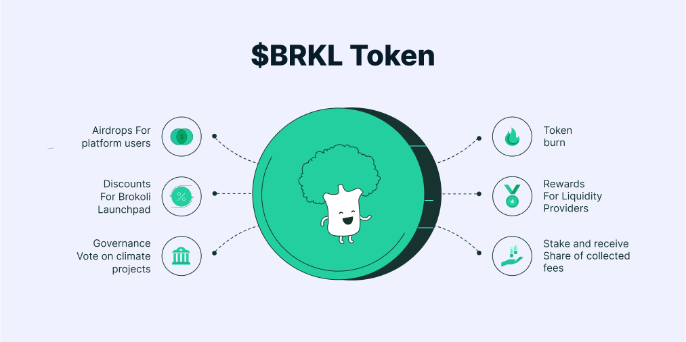

# 7. $BRKL Token

With the $BRKL token, Brokoli Network will be governed by a decentralized autonomous organization \(DAO\). With that, token holders will be able to cast their vote to decide the choice of renewable energy projects, e-waste collection and recycling programmes, and partners for planting trees. 

On top of that, we will introduce instant governance: a new kind of governance where the community can participate, benefit and vote for specific protocol settings without any barrier to entry. This will make the Brokoli Network fully community governed, efficient, user-friendly and transparent, where members can propose changes to how our system works. The community will be carried out using [Snapshot](https://docs.snapshot.org): an off-chain gasless multi-governance client with easy to verify and hard to contest results.

Brokoli will receive Climate Fees from Brokoli DEX, direct donations from companies and individuals, and API-collected Climate Fees in native tokens. Native tokens are then used to buy $BRKL tokens and distributed to $BRKL token holders that stake and participate in the community vote via airdrop. 

Of the climate fees collected, 10% of them will be used as community rewards for token holders, liquidity providers and platform users:  
  
- 1/3 paid out to **token holders that stake and vote for governance proposals**;  
- 1/3 randomly distributed to **platform users to incentivize product adoption**;  
- 1/3 used for **token burn**.

