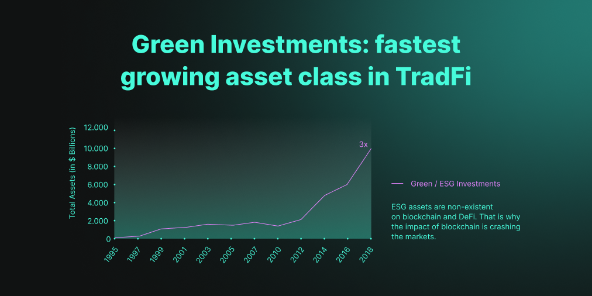

# 9. Market Overview

## 9.1. **Market Need**

DeFi and the blockchain community in general is experiencing scrutiny from the media and the wider public about the sustainability concerns to be addressed before any wider adoption can be achieved. In addition, there is a rise in sustainability-conscious platforms that are looking to find ways to offset their footprint. Simultaneously there is a lack of transparency and accountability associated with DeFi and digital assets, which makes many platforms less trustworthy. [87% of Gen Zers](https://sustainablebrands.com/read/marketing-and-comms/gen-z-believes-in-its-own-power-to-make-change-but-that-companies-must-lead-the-way) are concerned about the environment, including [90% of Gen Zers](https://sustainablebrands.com/read/marketing-and-comms/gen-z-believes-in-its-own-power-to-make-change-but-that-companies-must-lead-the-way) who think companies must lead the way in the planet’s sustainability journey. Similarly, more than [70% of millennials](https://climatecommunication.yale.edu/publications/do-younger-generations-care-more-about-global-warming/) care about global warming and other climate issues. [42% of millennials](https://www.coindesk.com/how-millennials-are-shaping-the-future-of-money) are planning to enter the crypto ecosystem, which means that the space will be forced to find long-term sustainability solutions like Brokoli. 

Our platform will fulfill the market need of both sustainable technical solutions \(DEX and dApps\) and trust-worthy charity. Also, we will gamify the process of donations and make charity social media friendly by issuing green NFTs. Finally, as we are the first entrant into the market of its kind that will use a decentralised and transparent system and will have the credibility from the track record of sustainable projects and Venture Capital partners, we will accept direct donations from individuals and corporates. We expect that our seamless and low fees of 9% will make Brokoli a desirable partner as fundraising and marketing costs of comparable charities are 30% or more.

Another huge area for growth for DeFi is institutional funds entering the space. However, due to ESG concerns and stakeholder activism, funds have not been able to that rapidly enough. The graph below shows the growth of green investments in traditional finance, which has not been addressed in DeFi.

## 9.2. **Market Size**

Due to the carbon footprint issues seen as the key obstacle to mass crypto adoption, we anticipate that at least 50% of the crypto donations market will belong to sustainability-oriented causes served by Brokoli. 

* As of May 2021, DEX trading volume is on pace to reach $5.4 trillion in 2021, and is growing at approximately 40% per month. If we assume that Brokoli will capture 10% of the market based on the users that prefer sustainability-driven solutions, our trading volume will reach $536 billion. If we further assume an average Climate Fee per transaction to be at 1%, Brokoli will collect **5.4 billion in donations** from our DEX. From that, 5% is distributed to token holders, which represents **$267.5 million in yearly income for liquidity providers.**
* DApps integrations will be an area for growth contingent on the business development efforts. The market size of dApps is expected to be $368 billion \(annual growth of 56.1%\) in the next 5 years. If 10% of the transaction volume is carried out with Brokoli API, this would mean an additional $36.8 billion in transaction value that could opt in for Climate Fee payments. If we assume an average 1% Climate Fee, this represents an additional **$368 million** in Climate Fee payments from dApps integrations. For liquidity providers, this would mean **$17.5 million in yearly income.** 
* The amount of direct charity donations in the crypto space are rapidly rising. A recent [report](https://cryptogivingtuesday.org/report-13300-btc-200-million-in-crypto-donated-to-charities/) showed $200 million in charity donations. We expect this market to reach $1+ billion in the next 5 years with green charities at the forefront of this increase. From that, we aim to become the go-to partner for carbon offsets as a first-mover to represent 20% of this market and additional **$200 million yearly Climate Fee**, which would generate **$8 million for liquidity providers.**

## 9.3. **Competition**

Brokoli will enter the market as the first climate-positive DEX and sustainability enabler on Layer 2 platforms. Therefore, there is no direct competition and Brokoli has the first-mover’s advantage.

### Indirect Competition

There are several indirect competitors that are also focusing on different aspects of sustainability in the crypto space. However, Brokoli envisions these projects as complements rather than competitors as all of us have the same goal of making crypto greener and more sustainable.

* \*\*\*\*[**Greeneum**](https://www.greeneum.net/) connects Green Energy producers, consumers, and investors, ensuring that clean energy is adequately funded, encouraged and traded efficiently on a global scale.  
* [**Impact Scope**](https://impactscope.com/) is a non-profit offering carbon offsets on their website.
* [**Chia Network**](https://www.chia.net/) created an eco-friendly blockchain based on a proof of time and space model that uses less energy for mining. 

