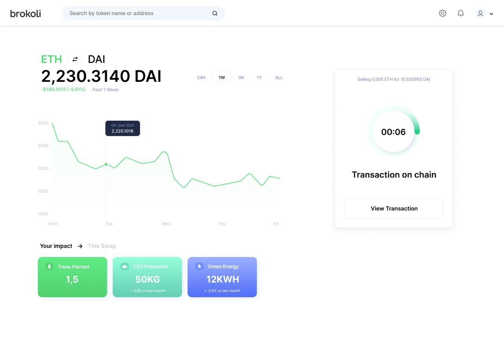

# 1. Overview

Climate impact has not been the primary concern when designing blockchain technology and its sustainability issues carried over to the Decentralized Finance \(DeFi\) space. In 2020 DeFi boomed: more and more people join the ecosystem every day, and while this presents new opportunities, it also brings sustainability challenges to the forefront.

Consequently, we are presented with a problem where many existing and dominating networks face a cluster of sustainability issues. The environmental impact of the blockchain technology makes Bitcoin’s financial sidechains and Ethereum, on which DeFi is based, an unsuitable long-term solution for widely adopted decentralized finance. 

DeFi has the potential to completely reinvent the world's financial systems but only if we address its climate-damaging nature. With more and more users in the space, there is increasing pressure to make DeFi climate positive.

### **The Need For a Solution**

If the DeFi community fails to address the issue of sustainability, DeFi might not reach global adoption because of its environmental impact. Every $1 of cryptocurrency value created is responsible for $0.66 in health and climate damages, according to [**a Harvard study**](https://dash.harvard.edu/bitstream/handle/1/37365412/MARTYNOV-DOCUMENT-2020.pdf?sequence=1)**.**

### **What is Brokoli?**

Brokoli is the ultimate sustainability layer of multi-chain DeFi.  
  
Brokoli merges DeFi and GameFi to incentivize users to make, own, and trade their positive impact. The project has three interconnected parts that all serve a single purpose: to rapidly grow Brokoli’s user base and offset DeFi’s carbon footprint.

**Brokoli’s core**: ****Environmentally friendly gateway into the most popular DEXs and dApps.

**API**: Any blockchain platform \(centralised or decentralised\) can implement our API to allow users to opt-in to a small climate fee that offsets their transaction’s footprint.

**Digital Forest / Brokoli Impact Credits**: Users receive NFTs based on trees they have funded the planting of by using our products and completing daily quests. Digital NFT forests will be tradable as Brokoli Impact Credits: Corporate Social Responsibility standard loosely pegged to real forests and purchased by corporate partners.

## Product Overview: Green Decentralised Exchange

{% embed url="https://www.figma.com/proto/hKOkZny9GaWG4SHDQlEQ6Q/DEX\_brokoli?node-id=0%3A30&scaling=scale-down-width" caption="Preview" %}

