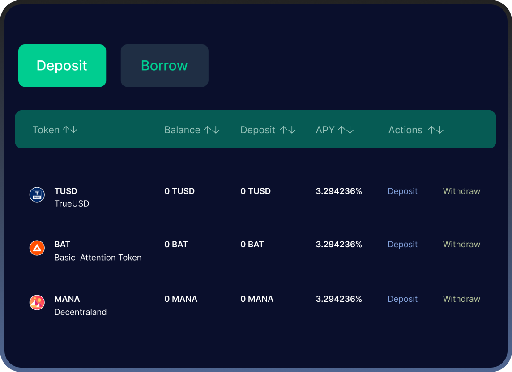

# 4. Core Features

## 4.1. **The First Climate-Positive Decentralised Exchange + dApps**

Brokoli’s Decentralised Exchange will enable carbon offsets to be part of every trade seamlessly and **without damaging user experience**. The DEX builds upon the more capital efficient model of trading enabled by Uniswap v3: slippage fees will be used for climate positive action: renewable energy project finance, planting trees, waste collection and recycling.&#x20;

Because of the volatility and rapid price movements, liquidity providers are not usually able to execute the trade at an agreed price. Slippage is the difference between the expected price of a trade and the executed price of that trade. It is more likely to happen when there is a higher level of volatility, such as breaking news that forces unexpected trends in the market. This condition can make it extremely unlikely for DEXs to be able to execute any trades at the expected price.&#x20;

Brokoli will leverage the existing technical infrastructure and become a green gateway to other DEXs, where the liquidity provider is in control of the price ranges in which their funds are used. This system is based on the concept of concentrated liquidity: prior to the trade, the price movements are bounded within an agreed price range. As a result, users will be able to flexibly choose the fee range - the initially supported fee tiers will range from 0.05% to 10% of the transaction.&#x20;

The fee for the transaction that is not used to offset the price movements will be used to offset carbon footprint in a decentralised vote (see Decentralised Offsetting Process for more details). Therefore, each trade will seamlessly have a climate fee attached to it without interrupting the user experience for liquidity providers, and **without increasing token exchange costs for the user**.&#x20;

**EXAMPLE:** On Brokoli’s DEX, a person chooses to exchange 1 ETH for Token X and sets the swap fee range at 1%. Let’s assume that during a transaction, 1 ETH depreciates by 0.1% in terms of Token X, and the trade is executed. This means that the climate fee is: 1% - 0.1% = 0.9% of the transaction value. As a result, the liquidity provider pays 1% of the transaction value to Brokoli, of which: 0.1% of transaction value is used to mitigate for volatility and 0.9% will be used for climate positive action.

**In the end, the user gets the same price that he would get on Uniswap - he chooses the slippage that he tolerates. Excess slippage then goes to positive climate offset solutions.**

## 4.2. Digital Forest: Play-to-Earn **NFTs for Planting Trees**

We will introduce elements of Play-to-Earn by issuing digital trees (comprising forests) as fractionalized NFTs, enabling users to own their impact. Digital Forests will function as a tradable asset, whereby users will be able to buy and sell their impact peer-to-peer or to a third party (companies, charities, NGOs, influencers).

**Ways to receive digital trees and build your forest:**

1\. Use our DEX, lending, investment platform, yield farming layer -> receive digital trees (based on climate fees collected from the use of those platforms);

2\. Complete daily quests  (e.g. reply to a tweet about Brokoli) -> receive digital trees (based on verified completion of tasks);&#x20;

3\. Refer a friend (Revolut referral model) -> Receive a share of trees your referred friend gets during the first month of the platform use;

4\. If you're a verified influencer, share news about Brokoli on Instagram, TikTok, and other social media platforms -> receive digital trees on influencer-exclusive daily tasks

Brokoli aims to cover all of your DeFi needs via the Green DEX, dApps, Investments and other products. Thus, every time you use our products, your impact will automatically grow the digital NFT forest. The more you use our platform, the more your forest grows, the more climate-positive assets you hold.

The received digital trees will be loosely pegged to the value of real-world forests planted as part of our DAO vote on climate projects. After you receive digital trees and start growing your forest, you will be able to:

* Navigate forests of other users
* Grow your forest and compete on the real-time leaderboard
* Buy and sell digital forests from other users with $BRKL token
* Customize and level up your Brokoli avatar - as you advance, more outfits, hairstyles, facial features and other perks will become available to purchase

Digital forests are designed to become Brokoli Impact Credit - an alternative to widely used carbon credits, pegged with the real-world forests. Impact Credits will be available to purchase by corporates as a Corporate Social Responsibility standard. Navigating the digital forest world, users will be able to see the companies owning forests, generating a marketing effect for those that opt in for Brokoli's Impact Credits.

In the long run, we aim to create a digital world of forest owners: as more users and corporations join, our digital forest portfolio will grow alongside the real-world forest portfolio. This will allow us to loosely peg digital forest price with that of a real forest.

A similar initiative was started by American Youtubers [MrBeast](https://en.wikipedia.org/wiki/MrBeast) and [Mark Rober](https://en.wikipedia.org/wiki/Mark\_Rober), and was mostly supported by other youtubers, entrepreneurs and philanthropists. [Team Trees](https://teamtrees.org), also known as  #teamtrees, is a collaborative fundraiser that raised $20 million before 2020 to plant 20 million trees.&#x20;

However, minting NFTs to commemorate planted trees would be counterproductive as NFTs also produce a major carbon footprint. Memo Akten [made headlines exposing](https://memoakten.medium.com/the-unreasonable-ecological-cost-of-cryptoart-2221d3eb2053) the energy inefficiency and environmental footprint of NFTs or Crypto Art. This single NFT’s footprint is equivalent to a EU resident’s total electric power consumption for more than a month, with emissions equivalent to driving for 1000 km, or flying for 2 hours. Therefore, instead of minting on-chain NFTs, Brokoli will use Immutable X to mint NFTs with a Layer 2 solution - this will minimize the environmental footprint of such NFTs to basically non-existent pollution levels.&#x20;

Using a Layer 2 solution will enable to promote mainstream NFT adoption by offering gas-free minting and trading, self custody alongside seamless UX for developers and consumers. As a result, we will gamify the efforts of planting trees while bringing more publicity and strengthening our climate-positive community.

## 4.3. **Front-end dApps integration and API**

We will build personalized embedded solutions that enable climate action in every DeFi transaction. In practice, any DeFi / blockchain platform will be able to implement our integration into their website. The integration will automatically calculate the carbon footprint based on the transaction and offer to offset your carbon footprint. With 1-click, a user on any digital asset marketplace, exchange, or a wallet will be able to make their transfer climate positive.

With our seamless integration, crypto platforms will get our all-in-one climate toolkit - software equipped to offer their customers climate options at check-out, in-app, or anywhere they meet their customers. Brokoli’s API will work closely with blockchain platforms to integrate carbon offsetting into modern, market-leading customer experiences.&#x20;

Once the user on a DeFi platform opts in to pay the Climate Fee, the digital assets will be sent to the Brokoli’s decentralised voting platform. The Climate Fee includes the funds used to offset carbon footprint, electrical energy used in the transaction, and electrical waste produced when mining digital assets. In a decentralised, community-led process, Brokoli will then allocate the funds to the renewable energy and waste collection & recycling projects that receive the biggest support from the BRKL token holders. With this API integration, blockchain platforms receive many benefits:

* **A win-win for DeFi platforms** - no cost, just the benefits of providing your customers with a choice to offset the climate cost of their transactions
* **Becoming the climate conscious company** - projects can use Brokoli will position them as a climate conscious company
* **Increasing the overall sustainability of blockchain transactions** - essential for wider global DeFi adoption
